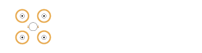
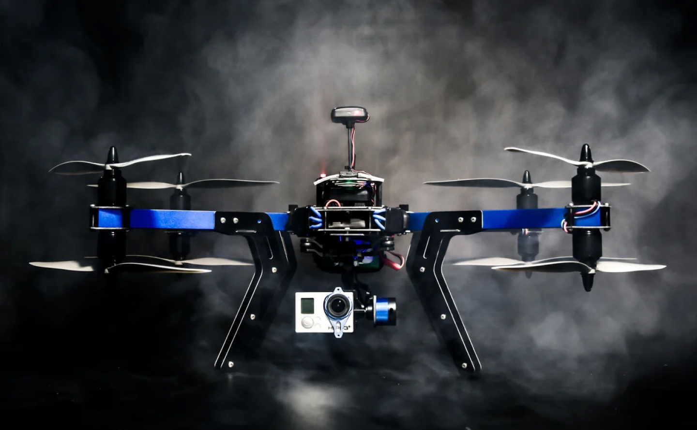

Description of Drone new 
========================

Fisrt paragraph
---------------

**Bold text**  
*Cursive text*  
***Bold cursive text***

__Bold text__  
_Cursive_

---
----

>"Everebody wants to 
be an austronaut"  
> # "aNOTHER quote  
>  
>>Yws
> - one
> - two

* First
* Second
* Third

1.  Firsr
2. Srcond
3. Third
    1. One 
    2. Two

1. one
2. two
    - one
    - two
3. 
        <html>
            <head>
            <title>Test</title>
            </head>
        <html>

3. three
   
    
## Another one

It's an example of `code and u know it`

``Use `code` in your Markdown file.``

***

    <html>
        <head>
        </head>
    </html>

My link example **[Link Example](https://google.com)**

Another link *[Link](https://yandex.ru)*  
And another link ***[Another link](http://yahoo.ru)***

<https://facebook.com>  
<gsrusin@gmail.com>

## Third part
***
And it's another day

This is a part of text with reference-style link. And this link is [here][1]. Link is followed by another paragraph. Another [reference-style link][2].

> "Links are usefull"

* this is a bullet in unordered list

\* This is not
---
--- 
End of document ---

[1]: <https://yandex.ru> "Reference Style Link"
[2]: <https://google.com> "google reference"