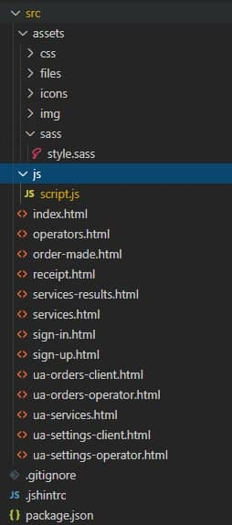

# Basic Web App structure

Структура прошлых проектов была примерно такой:  

---
## Новая структура с Pug, Sass, Gulp

Первая итерация структуры проекта с упором на модульность. В качестве примера - проект с дронами. На первом изображении - рабочая структура. Для каждой страницы свой файл html, 1 файл стилей, 1 файл скриптов. 

Особенность этой версии в том. что идет организации каталогов **по технологиям**: 
1. Исходники разметки создаются в препроцессоре pug. модульность идет на уровне секций страниц.   

2. Общий скрипт script.js собирается из отдельных модулей, каждый из которых реализует свою логику. Общий сбор скрипта будет обеспечиваться утилитой webpack.  

3. Исходники стилей организованы по системе 6+1. Один общий исходник стилей main.sass и 6 каталогов для отдельных модулей. Например, в папке components, для каждого модуля (над степенью дробления пока работаю) представлен отдельный файл sass.  

---
## Сборка проекта

Сборка проекта состоит из двух частей: 
1. сборка файлов в каталог build - готовые html страниц, файл стилей min.css, файл скрипта min.js.
2. Сборка файлов c разметкой в формате  html, разбитых по модулям, для дальнейшей на сборки на стороне бэка. Примерная структура каталога build_cat:  

---
## Description of Sass/SCSS folders 

Вставка с описанием каталогов для стилей Sass:  

1. base/ - animations, base, typography, and utilies, reset styles
2. components/ - have a single scss/sass file for each individual component
3. layout/ - header, footer, grid, navigation
4. pages/ - single scss/sass file for each page
5. abstracts/ - handles functions, mixins, variables
6. vendors/ - 3rd party css,